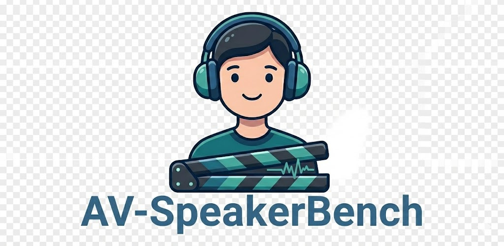

<h1 align="center">
  
  See, Hear, and Understand: Benchmarking Audiovisual Human Speech Understanding in Multimodal Large Language Models
</h1>

Le Thien Phuc Nguyen, Zhuoran Yu, Samuel Low Yu Hang, Subin An, Jeongkik Lee, Yohan Ban, SeungEun Chung, Thanh-Huy Nguyen, Juwan Maeng, Soochahn Lee, Yong Jae Lee 

---

AV_eval_pipeline evaluates audio-visual QA models on the Holistic AVQA benchmark. It cuts video/audio clips, runs your model, and logs per-question responses plus aggregated accuracy.

## Contents
- [Environment](#environment)
- [Data](#data)
- [Quick Eval](#quick-eval)
- [Add Your Model](#add-your-model)
- [Outputs](#outputs)
- [Citation](#citation)

## Environment
- Create an env: `conda env create -f environment.yml` or your own venv.
- Core deps: `pip install huggingface-hub datasets "moviepy>=2.0"`.
- Install your model’s extras (e.g., `transformers`, `peft`, etc.).
- Optional: set `HF_HOME` to control Hugging Face cache (see footer of `main.py`).

## Data
- Update `local_dir` in `download_data.py` if needed.
- Download: `python download_data.py`.
- Use the downloaded root as `--data_path` for evaluation.

## Quick Eval
```bash
python main.py \
  --data_path /path/to/Holistic_AVQA_bench \
  --model_name Qwen3-Omni-3B \
  --task_id dev \           # optional: filter by task id
  --category <cat> \        # optional: filter category
  --sub_category <subcat> \ # optional: filter subcategory
  --audio                   # optional: audio-only; use --visual for video-only
```

## Add Your Model
1) Place code under `model/open_model/` (see `model/open_model/Qwen3Omni` as a template).  
2) Export your init/process functions from `model/open_model/__init__.py`.  
3) In `model/__init__.py`, add a new `model_init` branch (lines ~82–111) returning `(model, tokenizer, ...)`.  
4) Extend `model/__init__.py` processing (lines ~228–277) to call your `model_process(model, tokenizer, video, audio, ...)` and return a text answer.  
5) Register the save logic in `main.py`:
    ```python
    elif args.model_name == "your_model":
        print("=" * 5 + "your model" + "=" * 5)
        with open("result/your_model.json", "w") as f:
            json.dump(result, f, indent=2)
        with open(f"record/your_model_record_{args.task_id}.json", "w") as f:
            json.dump(records, f, indent=2)
    ```

## Outputs
- Accuracy: `result/<model>.json`
- Per-question responses: `record/<model>_record_*.json`
- Temporary clips: `args.temp_dir` (default `./temp`, cleaned per question)

## Citation
If you use this benchmark or code, please cite:
```
See, Hear, and Understand: Benchmarking Audiovisual Human Speech Understanding in Multimodal Large Language Models
Le Thien Phuc Nguyen, Zhuoran Yu, Samuel Low Yu Hang, Subin An, Jeongkik Lee, Yohan Ban, SeungEun Chung, Thanh-Huy Nguyen, Juwan Maeng, Soochahn Lee, Yong Jae Lee
```
