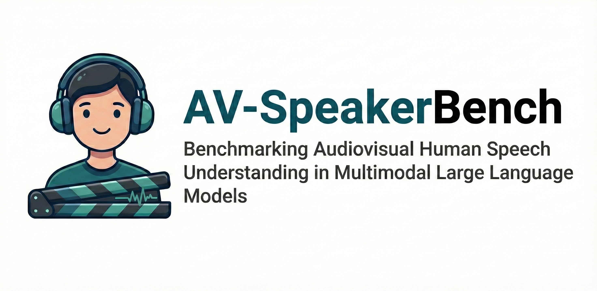
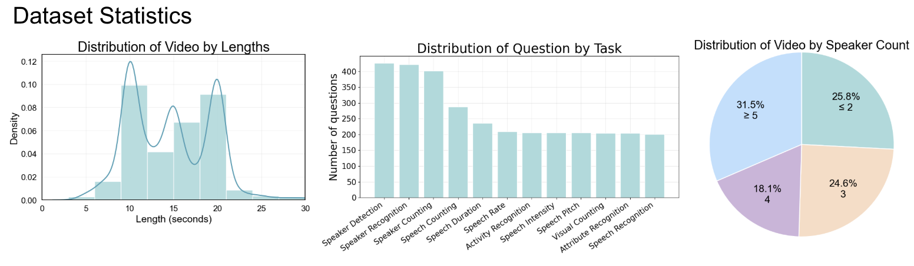
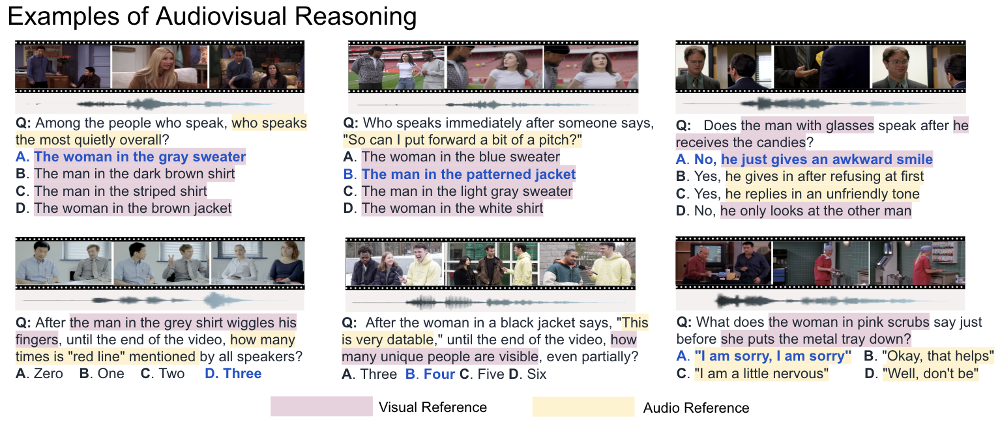

<div align="center" style="margin-bottom: 16px;">
  <h1 style="margin: 0; font-size: 34px; font-weight: 800; line-height: 1.25;">
    See, Hear, and Understand: Benchmarking Audiovisual Human Speech Understanding in Multimodal Large Language Models
  </h1>
</div>

[Le Thien Phuc Nguyen*](https://plnguyen2908.github.io/), [Zhuoran Yu*](https://www.zhuoranyu.com/), Samuel Low Yu Hang, Subin An, Jeongkik Lee, Yohan Ban, SeungEun Chung, [Thanh-Huy Nguyen](https://www.linkedin.com/in/antares0811/), Juwan Maeng, [Soochahn Lee](https://sites.google.com/view/soochahnlee/), [Yong Jae Lee](https://pages.cs.wisc.edu/~yongjaelee/) (* equal contribution)

<p align="center" style="width: 100%;">
  
</p>

---

TL;DR: AV-SpeakerBench evaluates multimodal large langague models (MLLMs) on speakers conversation understanding audiovisually.

## Contents
- [Overview](#overview)
- [Environment](#environment)
- [Data](#data)
- [Quick Eval](#quick-eval)
- [Add Your Model](#add-your-model)
- [Outputs](#outputs)
- [Citation](#citation)

## Overview

AV-SpeakerBench is a curated benchmark of 3,212 multiple-choice questions that tests speaker-centric audiovisual reasoning in real-world videos. Unlike prior video datasets where many tasks are visually solvable or only loosely tied to speech, AV-SpeakerBench explicitly evaluates whether models can align who speaks, what is said, and when it happens. Questions are written with fusion-grounded semantics (audio–visual anchors) and expert-curated annotations to ensure temporal and cross-modal correctness. Initial results show that Gemini 2.5 Pro leads overall performance, while the gap between Gemini and strong open models such as Qwen3-Omni-30B highlights persistent weaknesses in audiovisual fusion.


<p align="center" style="width: 100%;">
  
</p>


- **Clip length** – Videos are short, natural clips (mostly under ~25 seconds), since most of the open models only sample 8-10 frames.

- **Task coverage** – Each clip is annotated with questions spanning 11 audio-visual perception tasks (e.g., speaker detection/recognition/counting, speech duration/rate/intensity/pitch, activity, attribute recognition, visual counting, and speech recognition).

- **Speaker diversity** – Scenes cover a wide range of interaction settings: ~25.8% of videos have ≤2 speakers, 24.6% have 3, 18.1% have 4, and 31.5% contain ≥5 speakers, encouraging robust performance in crowded, multi-speaker scenarios.

<p align="center" style="width: 100%;">
  
</p>


**Cross-modal anchor question design (key novelty).**  
We design each question so that solving it *requires* true audio–visual alignment via an explicit anchor–target structure.

- **Audio-centric tasks → visual anchor.**  
  Example: *“After the man in the grey shirt wiggles his fingers, until the end of the video, how many times is `red line` mentioned by all speakers?”*  
  Here, the model must first **use the visual anchor** (“the man in the grey shirt wiggles his fingers”) to find the correct time span, and then **listen** within that window to count how many times the phrase “red line” is spoken.

- **Visual-centric tasks → audio anchor.**  
  Example: *“After the woman in a black jacket says, `This is very datable,` until the end of the video, how many unique people are visible, even partially?”*  
  In this case, the model must first **use the audio anchor** (the quoted utterance) to locate the right moment in the audio stream, and then **inspect the video** to count distinct visible people.

- **Speaker-centric tasks → mixed anchors and answer cues.**  
  For speaker reasoning (e.g., “Among the people who speak, who speaks the most quietly overall?”), questions may use either **visual or audio anchors**, while answer choices differ in the **opposite modality** (e.g., visually distinct people who share the scene or people who say different lines). This mixed design forces the model to jointly track *who*, *when*, and *where* across modalities, making unimodal shortcuts much harder.


## Environment
- Core deps: `pip install huggingface-hub datasets "moviepy>=2.0"`.
- Install your model’s extras (e.g., `transformers`, `peft`, etc.).
- Optional: set `HF_HOME` to control Hugging Face cache (see footer of `main.py`).

## Data
- Update `local_dir` in `download_data.py` if needed.
- Download: `python download_data.py`.
- Use the downloaded root as `--data_path` for evaluation.

## Quick Eval
```bash
python main.py \
  --data_path /path/to/Holistic_AVQA_bench \
  --model_name Qwen3-Omni-3B \
  --task_id dev \           # optional: filter by task id
  --category <cat> \        # optional: filter category
  --sub_category <subcat> \ # optional: filter subcategory
  --audio                   # optional: audio-only; use --visual for video-only
```

## Add Your Model

### For open models
1) Place code under `model/open_model/` (see `model/open_model/Qwen3Omni` as a template). 
2) Export your init/process functions into `model/open_model/__init__.py`.  
3) In `model/__init__.py`, add a new `model_init` branch (lines ~82–111) returning `(model, tokenizer, ...)`.  
4) Extend `model/__init__.py` processing (lines ~228–277) to call your `model_process(model, tokenizer, video, audio, ...)` and return a text answer. Here we have three paths for you to choose: `new_video_path` (video with no audio), `new_audio_path` (audio only), and `new_combined_path` (video with audio).
5) Register the save logic in `main.py`:
    ```python
    elif args.model_name == "your_model":
        print("=" * 5 + "your model" + "=" * 5)
        with open("result/your_model.json", "w") as f:
            json.dump(result, f, indent=2)
        with open(f"record/your_model_record_{args.task_id}.json", "w") as f:
            json.dump(records, f, indent=2)
    ```

### For closed models that can be accessed through API
1) Place code under `model/closed/` (see `model/closed/gemini/` as a template).  
2) Export your init/process functions from `model/open_model/__init__.py`.  
3) In `model/__init__.py`, add a new `model_init` branch (lines ~82–111) returning `client, ...`. 
4) Extend `model/__init__.py` processing (lines ~228–277) to call your `model_process(client, video, audio, ...)` and return a text answer. Here we have three paths for you to choose: `new_video_path` (video with no audio), `new_audio_path` (audio only), and `new_combined_path` (video with audio).
5) Register the save logic in `main.py`:
    ```python
    elif args.model_name == "your_model":
        print("=" * 5 + "your model" + "=" * 5)
        with open("result/your_model.json", "w") as f:
            json.dump(result, f, indent=2)
        with open(f"record/your_model_record_{args.task_id}.json", "w") as f:
            json.dump(records, f, indent=2)
    ```

## Outputs
- Accuracy: `result/<model>.json`
- Per-question responses: `record/<model>_record_*.json`
- Temporary clips: `args.temp_dir` (default `./temp`, cleaned per question)

We have put the code for Gemini and Qwen 3-Omni 30B for you to replicate.

## Citation
If you use this benchmark or code, please cite:
```
to be filled
```
